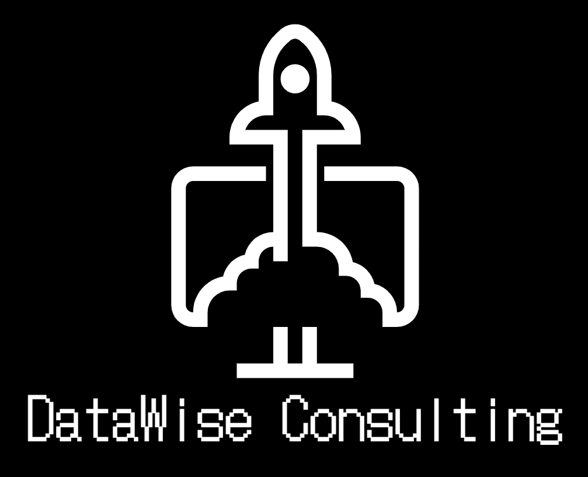

# <h1 align=center> **Proyecto final: Diseño de un sistema de recomendaciones basado en reseñas de google maps y yelp del mercado  gastronomico estadounidense** </h1>

---

#### ¡Bienvenidos al proyecto de análisis de datos de ciertos mercados estadounidenses, la mejora de sus estrategias de marketing e implementación de un sistema de recomendación! Nos complace presentar nuestro trabajo colaborativo de este proyecto final

---

### Somos **`DataWise Consulting`**, una joven consultora de data, pero con amplia experiencia y basto conocimiento en el análisis de datos, procesos empresariales y machine learning

---

## **Equipo**

Contamos con un equipo altamente colaborativo compuesto por 5 integrantes, cada uno con roles específicos y enfoques particulares:

#### Data Engineer

+ Juanfrank Douglas Jimenez Alfaro  ( [Github](https://github.com/franjuan8) - [LinkedIn]() )
+ Matias Felipe Olivares Duarte  ( [Github](https://github.com/saeram00) - [LinkedIn]() )

#### Data Analytics

+ María Guadalupe Martínez Jiménez ( [Github](https://github.com/Cora1218) - [LinkedIn]() )
+ Nelson Yamid Leal Rodriguez ( [Github](https://github.com/nelsonleal88) - [LinkedIn]() )

#### Machine Learning

+ Jesus Steven Arteaga Vela  ( [Github](https://github.com/jarteaga97) - [LinkedIn](https://www.linkedin.com/in/jesus-arteaga-w1506/) )

---

## **Contexto**

 Los usuarios de servicios de reseñas como `yelp` y `google maps` utilizan estos servicios para subir en forma de texto su experiencia vivida y nivel de satisfacción de algún bien o servicio consumido de un determinado mercado. Muchos usuarios leen las reseñas de los lugares a los que planean ir para tomar decisiones sobre dónde comprar, comer, dormir, reunirse, etc. Esta información es muy valiosa para las empresas, ya que les sirve para enterarse de la imagen que tienen los usuarios de los distintos locales de la empresa, siendo muy útil para medir el desempeño, utilidad del local, además de identificar los aspectos del servicio a mejorar.

---

## **Rol a desarrollar**

El equipo de `DataWise Consulting` realizará un analisis de mercado estadounidense de la opinión de los usuarios en Yelp y cruzarlos con los de Google Maps de empresas dedicadas a la gastronomía, utilizando análisis de sentimientos, para predecir cual de estos tipos de negocios crecerá más rápido (o decaerá).

Asimismo, con el análisis ser capaces de predecir dónde es conveniente aperturar nuevos locales, además de crear un sistema de recomendación para los usuarios de ambas plataformas capas de recomendar restaurantes y platillos similares basados en experiencias de consumo previo.

---

## **Propuesta de trabajo**

+ Recopilar, depurar y disponibilizar la información.
+ Creación de una base de datos (Data Warehouse).
+ Reporte y análisis significativos del top 5 estados más poblados.
+ Mejoramiento de estrategias de marketing: campañas microsegmentadas.
+ Entrenamiento y puesta en producción de un modelo de machine learning.

## **Objetivo principal**

+ Determinar la incidencia del diseño de un sistema de recomendaciones basado en reseñas de google maps y yelp del mercado  gastronomico estadounidense.

## **Objetivos específicos**

+ Realizar un análisis de sentimiento que permita deducir que tipos de franquisias gastronómicas crecerán más rápido o decaerán.
+ Generar un informe en formato de vizualización, sobre el análisis del meracado gastronómico de los cinco estados más poblados.
+ Crear un modelo de recomendaciones basados en experiencias de consumo previo.

## **KPI's**

| KPI | Objetivo | Rango |
|:------------- |:---------------:| -------:|
| Cantidad de reseñas positivas         | Aumentar en 5% las reseñas positivas de los restaurantes          | Semestral |
| Valor ratings         | Mejorar los ratings en un 10%          | Mensual |
| Cantidad de reseñas negativas         | Reducir la cantidad de quejas en un 10%          | Trimestral |
| Respuesta de local a reseñas         | Mejorar la presencia del local en un 10% mediante el análisis de las respuestas hacia los clientes de sus reseñas          | Semestral |
| Tasa de reseñas de restaurantes extranjeros         | Aumentar en un 5% la tasa de reseñas positivas de los restaurantes extranjeros          | Trimestral |
